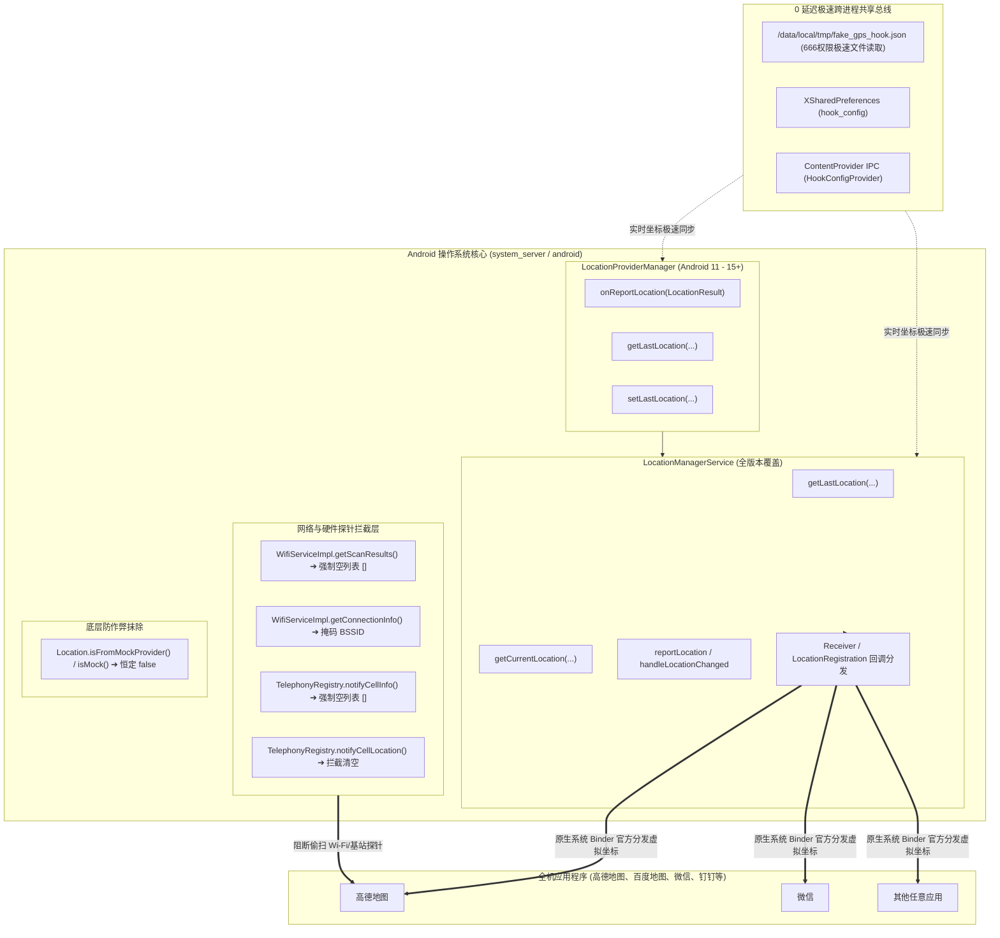

# 🛰️ Fake GPS (MockRun) — Android 系统级虚拟定位与路线巡航引擎

[](LICENSE)
[-green.svg)](https://developer.android.com)
[](https://kotlinlang.org)
[](https://developer.android.com/jetpack/compose)
[](https://github.com/LSPosed/LSPosed)

基于 **Kotlin + Jetpack Compose + LSPosed (system_server 系统层拦截)** 架构开发的高性能 Android 虚拟定位与路线巡航模拟引擎。

突破传统应用层 Hook 容易闪回真实地址与被风控检测的瓶颈，直接作用于 Android 操作系统内核服务 `system_server`（`android` 系统框架），由操作系统官方服务向全机所有应用程序（高德、微信、百度等）直接分发纯净原生坐标，**彻底解决定位闪回问题，实现目标 App 进程内 0 注入、0 痕迹**。

---

## 🌟 核心特性

### 1. 🏛️ system_server 操作系统级 Hook
- **全机统一生效**：只需在 LSPosed 中勾选【系统框架 (Android)】，无需在宿主 App 进程注入任何代码。
- **天然无闪回**：在系统服务底层 `LocationManagerService` 与 `LocationProviderManager` 直接改写分发流，杜绝 App 绕过检测偷取物理基站/GPS。
- **硬件探针阻断**：在系统底层屏蔽未授权偷扫 Wi-Fi AP 列表 (`WifiServiceImpl`) 与蜂窝基站数据 (`TelephonyRegistry`)，封死网络辅助定位后门。
- **Mock 标志位抹除**：分发的坐标天然携带系统签名，`isFromMockProvider` / `isMock()` 恒定为 `false`。

### 2. 🕹️ 全局桌面悬浮触控摇杆
- 独立半透明悬浮窗，不占用主界面。
- 支持 80dp ~ 220dp 自由缩放尺寸，适应单手盲操。
- 八方向微调与连续位移，支持步频步幅实时仿真。

### 3. 🛣️ 自动沿真实道路规划路线模拟
- **道路级路线生成**：在地图上选定起点和终点，自动基于实际路网算路并生成顺滑贴路轨迹，告别直线穿墙穿建筑。
- **多种出行方案**：驾车、骑行、步行三种路网拓扑模型可选。
- **GPX 轨迹导入**：支持 Keep、Strava、Garmin 等主流运动平台的 GPX 轨迹文件直接导入并自动拟真巡航。

### 4. 🏃 拟真物理运动算法
- **球面大圆插值**：沿路线轨迹逐米平滑步进。
- **Box-Muller 高斯噪声漂移**：模拟真实卫星因电离层与多径效应产生的微弱抖动（~0.3m 拟真漂移）。
- **动态配速抖动**：避免绝对匀速被运动算法模型判异。
- **航向角（Bearing）与高程（Altitude）实时解算**。

### 5. 🎨 现代极简 iOS + Material3 质感 UI
- 沉浸式顶部状态栏，全面兼容居中挖孔、药丸孔及曲面屏幕。
- 逆地理编码实时反查：经纬度秒级反查为真实中文道路街区门牌，支持一键复制。
- 2×2 模块健康矩阵：实时检测 LSPosed 状态、Root 提权、常驻通知及电池优化策略。

---

## 🏗️ 架构概览



---

## 🚀 安装与使用指南

### 前置要求
1. 设备已 Root（推荐 KernelSU、Magisk 或 APatch）。
2. 已安装 **LSPosed** 框架（Zygisk 版）。

### 配置步骤
1. **安装 APK**：从 Releases 下载最新版并安装。
2. **在 LSPosed 中勾选系统框架**：
   - 打开 **LSPosed 管理器**。
   - 找到并点击 **Fake GPS**。
   - 开启模块，并在作用域列表中勾选第一项：**【系统框架】（`android`）**。
3. **重启手机**：首次勾选系统框架后，请**重启手机**使系统服务挂载 Hook。
4. **启动定位**：
   - 打开 Fake GPS，在地图上选点或规划道路路线。
   - 开启「虚拟定位」或「悬浮摇杆」。
   - 打开任意地图软件，全局系统即刻生效，绝无闪回。

---

## 🛠️ 编译与开发

### 环境要求
- **JDK**：OpenJDK 17
- **Android SDK**：API Level 34 (Android 14) 或更高
- **Gradle**：8.4+

### 本地构建
```bash
# 克隆仓库
git clone https://github.com/<your-username>/FakeGPS.git
cd FakeGPS

# 构建 Debug APK
./gradlew assembleDebug

# 构建 Release APK
./gradlew assembleRelease
```
产物将输出在 `app/build/outputs/apk/debug/app-debug.apk`。

---

## ⚖️ 免责声明 (Disclaimer)

本项目仅供 **移动应用开发调试、软件逆向安全研究、自动化测试以及学术探索** 使用。

- 请勿将本项目用于任何违反当地法律法规、侵犯第三方合法权益或违反应用服务协议的场景。
- 开发者对使用者因不正当使用本软件而产生的任何直接或间接后果不承担任何法律责任。

---

## 📄 开源许可证

本项目基于 [Apache License 2.0](LICENSE) 协议开源。
