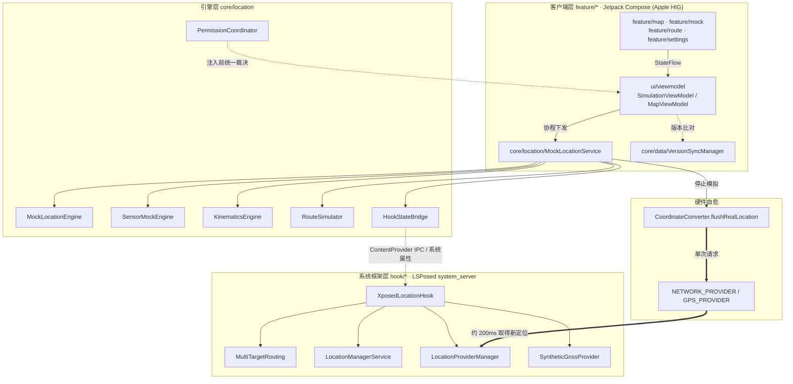

# FakeGPS-next

> 面向 Android 的虚拟定位与道路巡航仿真工具。界面遵循 Apple Human Interface Guidelines，支持系统框架级 Hook 注入、多应用独立分流、离线运动学仿真与多星座 GNSS 星历合成。

[](https://github.com/Elysia-SHY/FakeGPS-next/releases/latest)
[-34C759.svg?style=flat-square)](https://developer.android.com)
[](https://kotlinlang.org)
[](https://developer.apple.com/design/human-interface-guidelines/)
[](#注入模式-injection-modes)
[](https://github.com/LSPosed/LSPosed)
[](LICENSE)

> **当前版本**：`v1.5.0`（`versionCode = 27`）
>
> 版本号以 [`app/build.gradle.kts`](app/build.gradle.kts) 的 `versionName` / `versionCode` 为准，[`version.json`](version.json)、[`package.json`](package.json)、本文档与 [CHANGELOG.md](CHANGELOG.md) 与其保持一致。

**导航**：[架构亮点](#架构亮点-key-highlights) · [注入模式](#注入模式-injection-modes) · [模式对比](#工作模式对比-operation-modes) · [快速上手](#快速上手-quick-start) · [核心功能](#核心交互功能-features) · [源码构建](#源码构建-build-from-source) · [常见问题](#常见问题-faq) · [更新日志](#更新日志-changelog)

---

## 架构亮点 (Key Highlights)



### 双注入模式（Root / 免 Root）

- **一条开关切换**：设置页的「Root 注入模式」决定是否使用 Root 通道，两条路径互相独立。
- **免 Root 模式**：应用不调用任何 `su`，注入完全依赖标准 `LocationManager.addTestProvider`，由用户在【开发者选项】中手动把本应用勾选为「模拟位置信息应用」。
- **Root 模式**：通过 `su` 自动授予 `android:mock_location` 应用 op（并按需开启全局开发者选项开关），其余注入路径与免 Root 一致。用户无需手动打开开发者选项。
- **授权命令健壮性**：`appops` 与 `settings put` 分开执行、互不短路，并依次尝试 `appops set` / `cmd appops set` / `appops set --uid` 三种写法。
- **权限统一裁决**：所有注入入口（地图页、虚拟定位页、路线页、摇杆服务）统一经过 `PermissionCoordinator`，避免各页面重复判定产生行为分歧。

### 多应用独立分流路由

- **每个应用一套坐标**：可分别为不同应用指定虚拟位置与航线。例如钉钉在上海、微信在北京，高德地图仍走真实定位。
- **支持多开与工作资料**：分流规则以 `(PackageName, UserId)` 联合索引，主号与分身（如 User 999）可以绑定不同坐标。
- **未配置的应用不受影响**：不在分流列表内的应用继续使用真实卫星定位，日常导航照常可用。
- **跨进程 IPC**：通过 `HookConfigProvider` 与系统属性双通道缓存规则，避免在位置分发路径上反复读盘。

### 系统框架级集中拦截

- **只需勾选系统框架**：在 LSPosed 中启用「系统框架 (system)」即可，不必逐个勾选目标应用。
- **目标应用内不注入代码**：模块只在系统框架进程生效，目标应用进程里不加载 Xposed 类。这降低了被第三方反作弊扫描命中的概率，但不构成对检测的保证。
- **去除 Mock 标记**：由系统框架分发的坐标不再携带 mock 标记，`isFromMockProvider` 与 `isMock()` 返回 `false`。
- **抑制 AOSP 位移过滤**：定点驻留模式下动态放开 `minUpdateDistanceMeters` 限制并注入单调时钟，避免坐标因位移过小被底层丢弃。

### 离线运动学仿真引擎

- **弯道减速**：按三点外接圆估算道路曲率，据此约束航速（`v ≤ √(a_max · R)`），减少直角转弯与急刹。
- **步频微动模型**：按行走 / 跑步的落地周期模拟加速度波动与轻微横向偏移。
- **地形起伏**：结合路段距离与高斯扰动生成道路海拔曲线，避免出现全程同一海拔。

### 动态多星座 GNSS 星历合成

- **多星座卫星**：合成 16 至 24 颗北斗 (BDS)、GPS、GLONASS 卫星的空间分布。
- **动态信噪比**：按卫星仰角计算 24 至 42 dB-Hz 的载噪比，室内或遮挡场景叠加多径衰减。
- **应对搜星异常**：避免开启模拟后出现搜星数为 0、信噪比空缺这类容易被风控标记的状态。

### 框架分层与工程结构

- **分层清晰**：`feature/*`（界面与交互）、`ui/*`（组件、导航、ViewModel）、`core/location`（定位与仿真）、`core/data`（持久化与版本）、`core/designsystem`（主题与控件）、`hook/*`（系统框架层）、`util/*`（通用工具）。
- **依赖注入**：基于 Hilt 统一装配单例，`PermissionCoordinator`、`RootSuBridge`、`MockLocationEngine` 等跨页面共享。

### 云端版本与更新同步

- **三级容灾链路**：依次尝试 jsDelivr CDN、`raw.githubusercontent` 与 GitHub Releases API，国内网络下可直接访问，且不受 API 每小时 60 次的限流约束。
- **自动检测**：进入「关于」页时静默比对云端版本，可在应用内查看更新日志并跳转下载。

---

## 注入模式 (Injection Modes)

| 项目 | 免 Root 模式 | Root 模式 |
| :--- | :--- | :--- |
| **设备门槛** | 无 | 需 Magisk / KernelSU / APatch |
| **权限获取** | 手动在【开发者选项】勾选本应用为「模拟位置信息应用」 | `su` 自动授予 `android:mock_location` 应用 op |
| **是否调用 su** | 从不调用 | 仅用于授权与系统扫描恢复 |
| **注入通道** | 标准 `addTestProvider` | 标准 `addTestProvider`（与免 Root 相同） |
| **用户手动操作** | 需要（勾选模拟位置应用） | 不需要 |

> **LSPosed 与上面的模式正交**：它是**可选**的系统框架层增强（抗检测、per-app 分流、去除 mock 标记），并非注入的必要条件。Root 模式不开 LSPosed 也能正常注入；开启 LSPosed 后在上述基础上叠加框架层能力。

> **为什么 Root 模式仍要「设置模拟位置应用」？** 因为注入走的是 Android 公开的 `LocationManager.addTestProvider` 通道，系统把该通道锁在 `android:mock_location` 应用 op（即开发者选项里的「模拟位置信息应用」）上。Root 的职责是用 `appops` 自动把这个标记点好，因此你不会看到需要手动打开开发者选项。若要在完全不设置该标记的前提下注入，需要自研 `system_server` 层注入引擎，属另一量级工程。

---

## 工作模式对比 (Operation Modes)

| 核心特性 | 免 Root 模式 | Root 模式 | 叠加 LSPosed 模块 |
| :--- | :--- | :--- | :--- |
| **生效机制** | 应用进程 `addTestProvider` | 应用进程 `addTestProvider` | system_server 层改写分发结果 |
| **多应用独立分流** | 仅支持全局单点 | 仅支持全局单点 | 支持每应用绑定独立坐标与路线 |
| **Mock 标记** | 保留（`isMock = true`） | 保留（依赖应用层规避） | 在系统框架层去除 |
| **目标应用内注入** | 无 | 无 | 无，仅系统框架生效 |
| **停止后恢复真机定位** | 依赖系统重新搜星（约 15 至 60 秒） | 通常在 2 秒内 | 通常快于 300 毫秒 |
| **步频与计步仿真** | 不开放 | 开放传感器注入 | 开放传感器注入 |

---

## 快速上手 (Quick Start)

### 方式一：免 Root 模式

1. 从 [Releases 页面](https://github.com/Elysia-SHY/FakeGPS-next/releases/latest) 下载并安装最新 APK；
2. 打开 **【系统设置】→【开发者选项】→【选择模拟位置信息应用】**，选中 **Fake GPS**；
3. 打开应用，在地图上长按选点或使用搜索框，点击 **「开启虚拟定位」**。
4. 在设置页确认「Root 注入模式」处于 **关闭** 状态（此为默认以外的选项，默认开启 Root 模式）。

### 方式二：Root 模式

1. 安装最新 APK，确保设备已获取 Root（Magisk / KernelSU / APatch）；
2. 在设置页把「Root 注入模式」切到 **开启**。首次切换时应用会请求 Root 授权，允许即可；
3. 应用会自动完成 `android:mock_location` 授权，无需手动进入开发者选项；
4. 在设置页「Root 权限状态」一行确认显示 **已授权**。

### 方式三：叠加 LSPosed 系统框架（可选增强）

1. 在手机上安装并激活 **LSPosed**（Zygisk 模式）；
2. 在 LSPosed 管理器中启用本模块，**作用域只勾选「系统框架 (Android / android)」**，目标应用无需勾选；
3. 重启设备，或软重启 `system_server` 后生效；
4. 回到应用设置页，「LSPosed 系统框架」一行应显示 **已接管系统框架**。

---

## 核心交互功能 (Features)

- **地图图层双引擎**：内置高德路网（含 Apple Maps 风格的深色夜间滤镜）与 OpenStreetMap 两套底图，自动完成 GCJ-02 与 WGS-84 坐标转换。
- **多应用分流管理**：首页以抽屉式卡片列表展示分流规则，可自由添加应用并配置专属坐标；未配置的应用保持真实定位。
- **全路网道路巡航**：支持驾车、骑行、步行三种路网模型，沿真实道路平滑移动，可导入 GPX 路线文件。
- **桌面悬浮摇杆**：具备阻尼回弹与航向锁定，可实时调整配速（步行 5 km/h、跑步 12 km/h、骑行 25 km/h、驾车 60 km/h，以及瞬移）。
- **收藏与路线库**：地点收藏与航线收藏分列呈现，点按即可把地图与十字准星移到该点或载入该航线。
- **运行诊断**：关于页可一键查看设备型号、Android API 级别、CPU 架构与模块运行状态。

---

## 源码构建 (Build from Source)

### 环境要求

- **JDK**：OpenJDK 17
- **Android SDK**：API Level 34 (Android 14)
- **Gradle**：8.4（仓库内 `gradle/wrapper` 已固定）
- **Kotlin**：1.9.22 · **AGP**：8.2.2 · **Compose BOM**：2024.02.00

```bash
# 1. 克隆代码仓库
git clone https://github.com/Elysia-SHY/FakeGPS-next.git
cd FakeGPS-next

# 2. 编译 Release / Debug APK
# Windows PowerShell:
.\gradlew.bat assembleRelease
# Linux / macOS:
./gradlew assembleRelease
```

编译产物位于 `app/build/outputs/apk/release/app-release.apk`。

> 本地构建未设置 `FAKEGPS_KEYSTORE` 环境变量时，release 使用 AGP 的 debug 签名，与仓库内已发布的 APK **签名身份不同**。

### 源码结构

```
app/src/main/java/com/mockrun/app/
├── MainActivity.kt / MockRunApplication.kt
├── core/
│   ├── data/          持久化、GPX 解析、分流规则、版本同步
│   ├── designsystem/  主题、颜色、字体、iOS 风格控件、动效
│   └── location/      服务、注入引擎、仿真引擎、权限协调、坐标转换
├── domain/model/      领域模型（Route / WayPoint / MultiTargetRule 等）
├── feature/
│   ├── map/           地图选点与巡航控制
│   ├── mock/          虚拟定位控制台
│   ├── route/         路线模拟与路线库
│   └── settings/      设置与关于
├── hook/              系统框架层（LSPosed）
├── ui/                通用组件、导航、ViewModel
└── util/              诊断、注入模式、权限工具
```

### 自动构建与发布 (GitHub Actions)

仓库内置了发布流水线 [`.github/workflows/release.yml`](.github/workflows/release.yml)，在 GitHub 上点击 **Actions → Build & Publish Release APK → Run workflow** 即可（也可 push `v*` 标签触发）。

流水线一次完成：构建 release APK → 校验签名 → **把 APK 提交进仓库树** → 将 tag 指向该提交 → 创建/更新 GitHub Release，并在 Job Summary 中输出 APK 的 SHA-256 与签名证书指纹。

APK 之所以必须提交进仓库，而不是只作为 Release 资产：应用内更新的主下载路径是 jsDelivr 的 `/gh/{owner}/{repo}@{tag}/{file}.apk`，而 jsDelivr 的 `/gh/` 端点**只服务仓库文件，不服务 Release 资产**（详见 [`.gitignore`](.gitignore) 中的说明）。因此流程被固定为「先提交 APK，再创建 tag」。

签名密钥的解析顺序：

1. 仓库 Secret `ANDROID_KEYSTORE_BASE64`（另需 `ANDROID_KEYSTORE_PASSWORD`、`ANDROID_KEY_ALIAS`、`ANDROID_KEY_PASSWORD`）。把项目一直使用的 `~/.android/debug.keystore` 以 base64 填入即可让 CI 产物与历史版本签名连续、支持直接覆盖安装。
2. 未配置 Secret 时，回退到仓库内随源码提交的固定密钥 `keystore/fakegps-signing.jks`（alias `fakegps`，口令 `android`，仅用于 CI 出包，无保密价值）。它保证了 CI 产物在多次运行之间签名稳定。

> **升级提示**：若 CI 使用的密钥与设备上已安装版本不同，Android 会拒绝覆盖安装，需先卸载旧版（会清除本机收藏与分流配置）。应用内的下载安装同样会做签名比对，不一致时拒绝安装。

---

## 常见问题 (FAQ)

**Q：Root 模式为什么还要「模拟位置信息应用」这个设置？**
A：注入使用 Android 公开的 `LocationManager.addTestProvider`，该 API 被系统锁在 `android:mock_location` 应用 op（即开发者选项的「模拟位置信息应用」）上。Root 的作用是自动授予该权限，所以用户不需要手动操作，但这个标记客观上会被设置。

**Q：停用模拟后位置没有立刻恢复？**
A：停止路径会清理全部测试 Provider 并主动向 `GPS_PROVIDER` / `NETWORK_PROVIDER` 发起单次请求，通常数秒内恢复；室内无卫星信号时可能需要数十秒重新搜星。若长时间不恢复，请在设置页执行「恢复系统高精度定位」并确认 Wi-Fi 与蓝牙扫描未被关闭。

**Q：升级安装失败怎么办？**
A：确认新旧包签名一致。v1.4.2 起 CI 使用固定密钥，可从 v1.4.2 直接覆盖升级；v1.4.1 及更早为 debug 签名，需先卸载再安装（会清除收藏与分流配置）。

**Q：不开 LSPosed 能用吗？**
A：可以。Root 模式与免 Root 模式都不依赖 LSPosed，LSPosed 只提供系统框架层的额外能力（per-app 分流、去除 mock 标记、硬件静默时主动喂点）。

---

## 更新日志 (Changelog)

完整的历史演进记录见 [CHANGELOG.md](CHANGELOG.md)。

- **[v1.5.0]** (2026-09-19)：新增 `PermissionCoordinator` 统一注入前的权限裁决；Root 模式改为以授权命令结果放行，规避 `AppOpsManager` 进程内读取外部 `su` 写入时的缓存延迟导致误弹；授权命令拆分执行，避免 `&&` 短路。
- **[v1.4.7]** (2026-09-18)：新增「Root 注入模式」开关，把 Root 与免 Root 两条注入路径分离；LSPosed 明确为可选增强层。
- **[v1.4.8 / v1.4.9]**：已撤回。两版均未解决 Root 模式的权限弹窗问题，Release 与 tag 已一并移除。
- **[v1.4.6]** (2026-09-18)：重做「微信 / 打卡软件仍显示真实位置」排查板块，只保留 Root 一键关闭蓝牙 / Wi-Fi 与背景扫描；未 Root 时改为跳转系统设置引导。
- **[v1.4.5]** (2026-09-18)：修复 Root 模式停止模拟后位置残留：划掉卡片不再自愈复活续租，伪造配置改用单调时钟租约判定过期。
- **[v1.4.4]** (2026-09-18)：系统层 Hook 补齐 provider 状态查询、`requestLocationUpdatesLocked` 注册登记与硬件静默时的主动喂点；伪造点补齐海拔、方位角、速度、精度与卫星数。
- **[v1.4.3]** (2026-09-16)：新增右上角收藏夹入口，地点收藏与航线收藏分列呈现，按航点数区分、无需数据库迁移。
- **[v1.4.2]** (2026-09-15)：修复「收藏此点」失效与 release 下「收藏路线」闪退；发布流程迁移到 GitHub Actions。
- **[v1.4.1]** (2026-09-12)：安全加固：`HookConfigProvider` 按调用方 uid 收闸、配置文件权限收紧为 `0644`、`AdbCommandReceiver` 增加权限保护。
- **[v1.4.0]** (2026-09-12)：可观测性专项：新增统一诊断出口 `Diag` 与 `Result.logFailure()`，为多处 `runCatching` 补上失败记录；修复版本解析误报；下载包增加签名比对。
- **[v1.3.9]** (2026-09-12)：修复滑动时卡片毛玻璃偏移，精简壁纸逻辑，调整浮动按钮避让。
- **[v1.3.8]** (2026-09-12)：卡片毛玻璃改为全局通用，关于页支持自定义背景，底栏拖动联动。
- **[v1.3.7]** (2026-09-12)：毛玻璃材质改为静态晶体微光方案。
- **[v1.3.6]** (2026-09-12)：新增 GitHub Release 与 jsDelivr CDN 在线更新；引入 Haze 毛玻璃渲染库；关于页新增开源致谢与依赖清单。
- **[v1.3.5]** (2026-09-12)：版本同步改为多源并发竞速；应用内支持直接下载并安装 APK。
- **[v1.3.4]** (2026-09-12)：路线模拟支持 POI 与地名搜索；路线模式 UI 精简。
- **[v1.3.3]** (2026-09-12)：独立应用分流选点交互重构；路线巡航与分流模式解耦。
- **[v1.3.2]** (2026-09-12)：介绍页 UI 重构；新增云端版本同步与设备环境诊断面板。
- **[v1.3.1]** (2026-09-12)：补全 `HookConfigProvider` 导出；定点驻留模式增加 AOSP 丢包抑制。
- **[v1.3.0]** (2026-09-11)：多应用独立分流路由首发；离线物理动力学仿真引擎；动态多星座 GNSS 星历合成。
- **[v1.2.2]** (2026-09-11)：启用 R8 混淆与资源压缩，安装包由 56.2 MB 降至 3.53 MB；修复 MapView 内存泄漏与长航点跨进程传输异常。
- **[v1.2.1]** (2026-09-10)：解决退出后定位残留；不再改动系统扫描设置；实现室内 Wi-Fi 自愈刷新。
- **[v1.2.0]** (2026-09-10)：修复开启模拟时的界面卡顿与 ANR 风险；引入 20 秒心跳超时。
- **[v1.1.0]** (2026-09-09)：适配 Apple HIG 暗黑模式；新增高德夜间色阶矩阵滤镜；支持平板分屏布局。
- **[v1.0.0]** (2026-09-09)：正式版首发，包含权限引导向导与三模自适应架构。

---

## 开发者与 AI 协作 (Authors & AI Collaboration)

> 本项目由 AI 辅助构建。

| 角色 | 署名 | 参与方向 |
| :--- | :--- | :--- |
| **项目所有者 · 主开发者** | **Elysia-SHY** | 需求定义、架构决策、真机验证与版本发布 |
| **AI 辅助构建** | **ChatGPT**（OpenAI） | 架构设计评审、业务逻辑实现、问题定位与修复方案 |
| **AI 辅助构建** | **Claude**（Anthropic） | Kotlin / Jetpack Compose 实现、代码审查与重构、工程规范 |
| **AI 辅助构建** | **Gemini**（Google DeepMind） | Android 系统层与 Xposed / LSPosed Hook 方案、跨版本兼容适配 |
| **AI 辅助构建** | **DeepSeek 4.1 Flash**（DeepSeek） | 迭代实现、性能优化、文档与变更日志撰写 |

完整署名与开源项目致谢见 [AUTHORS.md](AUTHORS.md)。AI 模型属于辅助开发工具，不持有本项目著作权，也不对项目用途承担责任；全部权利与责任归属项目所有者。

---

## 免责声明 (Disclaimer)

本项目用于 **移动应用开发调试、地理信息系统开发与测试、安全研究及学术探索**。使用者须遵守所在地区的法律法规，不要将本项目用于违法违规、侵害第三方合法权益或违反服务条款的场景。开发者对使用本工具产生的任何直接或间接后果不承担责任。

---

## 开源许可证 (License)

本项目基于 [Apache License 2.0](LICENSE) 许可证开源发布。
