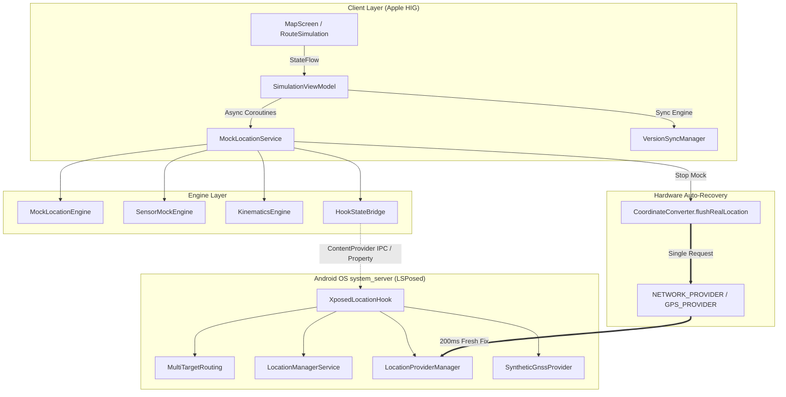

# FakeGPS-next

> 面向 Android 的虚拟定位与道路巡航仿真工具。界面遵循 Apple Human Interface Guidelines，支持系统框架级 Hook 注入与多应用独立分流。

[](https://github.com/Elysia-SHY/FakeGPS-next/releases/latest)
[-34C759.svg?style=flat-square)](https://developer.android.com)
[](https://kotlinlang.org)
[](https://developer.apple.com/design/human-interface-guidelines/)
[](https://github.com/LSPosed/LSPosed)
[](LICENSE)

[核心交互功能](#核心交互功能-features) · [架构亮点](#架构亮点-key-highlights) · [更新日志](#更新日志-changelog) · [下载最新版本](https://github.com/Elysia-SHY/FakeGPS-next/releases/latest)

> **当前版本**：`v1.4.5`（`versionCode = 22`）
>
> 版本号以 [`app/build.gradle.kts`](app/build.gradle.kts) 的 `versionName` / `versionCode` 为准，其余位置（[`version.json`](version.json)、[`package.json`](package.json)、本文档、[CHANGELOG.md](CHANGELOG.md)）与其保持一致。

---

## 架构亮点 (Key Highlights)



### 多应用独立分流路由

- **每个应用一套坐标**：可分别为不同应用指定虚拟位置与航线。例如钉钉在上海、微信在北京，高德地图仍走真实定位。
- **支持多开与工作资料**：分流规则以 `(PackageName, UserId)` 联合索引，主号与分身（如 User 999）可以绑定不同坐标。
- **未配置的应用不受影响**：不在分流列表内的应用继续使用真实卫星定位，日常导航照常可用。
- **跨进程 IPC**：通过 `HookConfigProvider` 与系统属性双通道缓存规则，避免在位置分发路径上反复读盘。

### 系统框架级集中拦截

- **只需勾选系统框架**：在 LSPosed 中启用「系统框架 (system)」即可，不必逐个勾选目标应用。
- **目标应用内不注入代码**：模块只在系统框架进程生效，目标应用进程里不加载 Xposed 类。这降低了被第三方反作弊扫描命中的概率，但不构成对检测的保证。
- **去除 Mock 标记**：由系统框架分发的坐标不再携带 mock 标记，`isFromMockProvider` 与 `isMock()` 返回 `false`。
- **抑制 AOSP 位移过滤**：定点驻留模式下动态放开 `minUpdateDistanceMeters` 限制并注入单调时钟，避免坐标因位移过小被底层丢弃。

### 离线运动学仿真引擎

- **弯道减速**：按三点外接圆估算道路曲率，据此约束航速（`v ≤ √(a_max · R)`），减少直角转弯与急刹。
- **步频微动模型**：按行走 / 跑步的落地周期模拟加速度波动与轻微横向偏移。
- **地形起伏**：结合路段距离与高斯扰动生成道路海拔曲线，避免出现全程同一海拔。

### 动态多星座 GNSS 星历合成

- **多星座卫星**：合成 16 至 24 颗北斗 (BDS)、GPS、GLONASS 卫星的空间分布。
- **动态信噪比**：按卫星仰角计算 24 至 42 dB-Hz 的载噪比，室内或遮挡场景叠加多径衰减。
- **应对搜星异常**：避免开启模拟后出现搜星数为 0、信噪比空缺这类容易被风控标记的状态。

### 云端版本与更新同步

- **三级容灾链路**：依次尝试 jsDelivr CDN、`raw.githubusercontent` 与 GitHub Releases API，国内网络下可直接访问，且不受 API 每小时 60 次的限流约束。
- **自动检测**：进入「关于」页时静默比对云端版本，可在应用内查看更新日志并跳转下载。

---

## 工作模式对比 (Operation Modes)

| 核心特性 | 免 Root 模式 | Root 模式 | LSPosed 模块模式 |
| :--- | :--- | :--- | :--- |
| **设备门槛** | 无门槛 | 需 Magisk / KernelSU / APatch | 需已激活 LSPosed |
| **生效机制** | 开发者选项中的「模拟位置信息应用」 | AppOps 提权 + 传感器注入 | system_server 层改写分发结果 |
| **多应用独立分流** | 仅支持全局单点 | 仅支持全局单点 | 支持每应用绑定独立坐标与路线 |
| **Mock 标记** | 保留（`isMock = true`） | 依赖应用层规避 | 在系统框架层去除 |
| **目标应用内注入** | 无 | 存在提权痕迹 | 无，仅系统框架生效 |
| **停止后恢复真机定位** | 依赖系统重新搜星（约 15 至 60 秒） | 通常在 2 秒内 | 通常快于 300 毫秒 |
| **步频与计步仿真** | 不开放 | 开放传感器注入 | 开放传感器注入 |

---

## 快速上手 (Quick Start)

### 方式一：LSPosed 系统框架模式

1. 在手机上安装并激活 **LSPosed**（Zygisk 模式）；
2. 从 [Releases 页面](https://github.com/Elysia-SHY/FakeGPS-next/releases/latest) 下载并安装 **FakeGPS-next-v1.4.5-release.apk**；
3. 在 LSPosed 管理器中启用本模块，**作用域只勾选「系统框架 (Android / android)」**，目标应用无需勾选；
4. 重启设备，或软重启 `system_server` 后生效。

### 方式二：免 Root 模式

1. 安装 FakeGPS-next-v1.4.5-release.apk；
2. 打开 **【系统设置】→【开发者选项】→【选择模拟位置信息应用】**，选中 **Fake GPS**；
3. 打开应用，在地图上长按选点或使用搜索框，点击 **「开启单点定位」**。

---

## 核心交互功能 (Features)

- **地图图层双引擎**：内置高德路网（含 Apple Maps 风格的深色夜间滤镜）与 OpenStreetMap 两套底图，自动完成 GCJ-02 与 WGS-84 坐标转换。
- **多应用分流管理**：首页以抽屉式卡片列表展示分流规则，可自由添加应用并配置专属坐标；未配置的应用保持真实定位。
- **全路网道路巡航**：支持驾车、骑行、步行三种路网模型，沿真实道路平滑移动，可导入 GPX 路线文件。
- **桌面悬浮摇杆**：具备阻尼回弹与航向锁定，可实时调整配速（步行 5 km/h、跑步 12 km/h、骑行 25 km/h、驾车 60 km/h，以及瞬移）。
- **运行诊断**：关于页可一键查看设备型号、Android API 级别、CPU 架构与模块运行状态。

---

## 源码构建 (Build from Source)

### 环境要求

- **JDK**：OpenJDK 17
- **Android SDK**：API Level 34 (Android 14)
- **Gradle**：8.4 及以上

```bash
# 1. 克隆代码仓库
git clone https://github.com/Elysia-SHY/FakeGPS-next.git
cd FakeGPS-next

# 2. 编译 Release / Debug APK
# Windows PowerShell:
.\gradlew.bat assembleRelease
# Linux / macOS:
./gradlew assembleRelease
```

编译产物位于 `app/build/outputs/apk/release/app-release.apk`。

> 本地构建未设置 `FAKEGPS_KEYSTORE` 环境变量，release 使用 AGP 的 debug 签名，与仓库内已发布的 APK **签名身份不同**。

### 自动构建与发布 (GitHub Actions)

仓库内置了发布流水线 [`.github/workflows/release.yml`](.github/workflows/release.yml)，在 GitHub 上点击 **Actions → Build & Publish Release APK → Run workflow** 即可（也可 push `v*` 标签触发）。

流水线一次完成：构建 release APK → 校验签名 → **把 APK 提交进仓库树** → 将 tag 指向该提交 → 创建/更新 GitHub Release，并在 Job Summary 中输出 APK 的 SHA-256 与签名证书指纹。

APK 之所以必须提交进仓库，而不是只作为 Release 资产：应用内更新的主下载路径是 jsDelivr 的 `/gh/{owner}/{repo}@{tag}/{file}.apk`，而 jsDelivr 的 `/gh/` 端点**只服务仓库文件，不服务 Release 资产**（详见 [`.gitignore`](.gitignore) 中的说明）。因此流程被固定为「先提交 APK，再创建 tag」。

签名密钥的解析顺序：

1. 仓库 Secret `ANDROID_KEYSTORE_BASE64`（另需 `ANDROID_KEYSTORE_PASSWORD`、`ANDROID_KEY_ALIAS`、`ANDROID_KEY_PASSWORD`）。把项目一直使用的 `~/.android/debug.keystore` 以 base64 填入即可让 CI 产物与历史版本签名连续、支持直接覆盖安装。
2. 未配置 Secret 时，回退到仓库内随源码提交的固定密钥 `keystore/fakegps-signing.jks`（alias `fakegps`，口令 `android`，仅用于 CI 出包，无保密价值）。它保证了 CI 产物在多次运行之间签名稳定。

> **升级提示**：若 CI 使用的密钥与设备上已安装版本不同，Android 会拒绝覆盖安装，需先卸载旧版（会清除本机收藏与分流配置）。应用内的下载安装同样会做签名比对，不一致时拒绝安装。

---

## 更新日志 (Changelog)

完整的历史演进记录见 [CHANGELOG.md](CHANGELOG.md)。

- **[v1.4.5]** (2026-09-18)：修复 root 模式下停止模拟后位置仍有残留的问题：划掉卡片不再自愈复活续租，伪造配置改用单调时钟租约判定是否过期（重启后残留与系统时间倒退都不再被当成有效）。停止时仍清理全部持久通道并恢复定位与扫描开关。
- **[v1.4.4]** (2026-09-18)：只改系统层 Hook，解决「坐标是对的但目标应用不动」的三类情况。Provider 状态查询（isProviderEnabled / getBestProvider / getProviders）在伪造生效时返回一致结果，避免应用查完就放弃请求；注册登记补到 requestLocationUpdatesLocked，硬件静默时仍有可推送目标；新增守护线程在 GPS 关闭或室内无信号时按 1 秒间隔主动喂点，硬件正常上报时不重复推送；伪造点的海拔、方位角、速度、精度与卫星数不再留 0，避免被应用判为无效定位丢弃。
- **[v1.4.3]** (2026-09-16)：新增右上角收藏夹入口，把地点收藏与航线收藏分开呈现。定位标签与路线标签的右上角工具胶囊里新增收藏夹按钮（紧邻底图切换），点按即打开本类收藏清单，不必再展开底部面板。「定位」列出以单点入库的收藏地点并显示 WGS-84 坐标，点按即把地图与十字准星移到该点并设为当前目标，不写入绘制航点与已选路线；「路线」列出手绘、GPX 导入与沿路规划的航线，显示折点数与总里程，点按即载入为当前路线并标注当前已载入的那条。两类收藏同源，按航点数区分（收藏地点恒为 1 个航点、航线至少 2 个），因此无需给 `RouteEntity` 增加类型列与数据库迁移，升级不丢既有数据；弹层内可直接删除，带二次确认。
- **[v1.4.2]** (2026-09-15)：修复两处收藏缺陷，并把发布流程改为 GitHub Actions 自动构建。其一，首页（定位标签）「收藏此点」失效：该按钮此前复用 `saveCurrentRoute()`，而后者读取手绘航点并要求至少 2 个点，定位标签下航点恒为空，函数在 `size < 2` 守卫处直接返回，收藏既不落库也不报错，界面却仍提示成功；现新增 `MapViewModel.saveLocationPoint()` 以单点构造 `Route` 入库并回传真实结果。其二，release 构建下「收藏路线」必闪退：`RouteRepository.toDomain()` 的 `object : TypeToken<List<WayPoint>>() {}` 在 R8 处理后丢失泛型签名，Gson 抛 `IllegalStateException: TypeToken must be created with a type argument`，且该句位于 `runCatching` 之外，异常直接终止进程；现改用 `TypeToken.getParameterized()` 运行时组装类型，`MultiTargetRepository` 的同类写法一并修正，并在 `proguard-rules.pro` 补入 Gson 保留规则。此外，地址未解析完成时收藏命名回退为「纬度, 经度」，坐标非法时拒绝入库并记入 `Diag`。本版同时包含 v1.4.1 之后 main 上已合入的「稳定晶体玻璃」UI 回滚。
- **[v1.4.1]** (2026-09-12)：安全加固，不新增功能。跨进程接口 `HookConfigProvider` 改为按调用方 uid 校验，只放行应用自身、system、root 与 shell；hook 配置文件权限由 `0666` 收紧为 `0644`，保留跨进程只读，去掉任意应用改写坐标的通道；`AdbCommandReceiver` 增加 `WRITE_SECURE_SETTINGS` 权限保护。另修复一处导入冲突导致的编译问题。
- **[v1.4.0]** (2026-09-12)：可观测性专项，不改业务逻辑。新增统一诊断出口 `Diag`（App 进程走 `Log`，被注入进程额外镜像到 `XposedBridge`，按标签限流 10 秒 5 条）与 `Result.logFailure()`，为 94 处 `runCatching` 中的 63 处补上失败记录；修复在线更新把 `v1.3.9` 解析成 `139` 导致每次启动都提示更新的问题；下载 APK 增加签名证书比对，与已安装应用不一致时拒绝安装。
- **[v1.3.9]** (2026-09-12)：修复滑动时卡片毛玻璃画面偏移，精简自定义壁纸逻辑，上移右侧浮动按钮避让底栏，去掉地图上的模糊残影。
- **[v1.3.8]** (2026-09-12)：卡片毛玻璃改为全局通用（双 `HazeState`），关于页支持自定义背景，底栏拖动时页面跟随联动。
- **[v1.3.7]** (2026-09-12)：毛玻璃材质改为静态晶体微光方案：多层渐变半透明底衬、细高光描边、内侧倒角高光，高光绘制下沉到 `drawBehind` 以保持前景文字与图标的对比度；更新弹窗背景同步适配。
- **[v1.3.6]** (2026-09-12)：新增 GitHub Release 与 jsDelivr CDN 在线更新（官方 API 检查、CDN 分发、启动弹窗与下载安装、Android 8 至 15 适配）；引入 Chris Banes Haze 毛玻璃渲染库；关于页新增开源致谢与依赖清单。
- **[v1.3.5]** (2026-09-12)：版本同步改为多源并发竞速，解决挂加速器或 VPN 时拉取不到最新版的问题；应用内支持直接下载并安装 APK（含进度与速度显示、断点轮询）；修复路线模拟与定位搜索框文字被上下裁切。
- **[v1.3.4]** (2026-09-12)：路线模拟支持 POI 与地名搜索（选点阶段新增搜索栏与联想下拉卡片）；路线模式 UI 精简，移除顶部横幅与冗余按钮；分流控制面板纵向结构优化。
- **[v1.3.3]** (2026-09-12)：独立应用分流选点交互重构（准心指示、底部面板保存确认、按需落盘）；路线巡航与分流模式解耦，两者可同时使用。
- **[v1.3.2]** (2026-09-12)：介绍页 UI 重构，解决标签挤压并扩充底部安全边距；新增云端版本与更新日志自动同步；新增设备环境与运行诊断面板。
- **[v1.3.1]** (2026-09-12)：补全 `HookConfigProvider` 导出，解决派发监听器的 CallerIdentity 解析问题；定点驻留模式增加 AOSP 丢包抑制。
- **[v1.3.0]** (2026-09-11)：多应用独立分流路由首发；离线物理动力学仿真引擎；动态多星座 GNSS 星历合成。
- **[v1.2.2]** (2026-09-11)：启用 R8 混淆与资源压缩，安装包由 56.2 MB 降至 3.53 MB；修复 MapView 内存泄漏与长航点跨进程传输异常。
- **[v1.2.1]** (2026-09-10)：解决退出后定位残留；不再改动系统扫描设置；实现室内 Wi-Fi 自愈刷新；适配 Android 12 至 15 的 LocationResult。
- **[v1.2.0]** (2026-09-10)：修复开启模拟时的界面卡顿与 ANR 风险；引入 20 秒心跳超时；注销测试 Provider 以复位系统状态。
- **[v1.1.0]** (2026-09-09)：适配 Apple HIG 暗黑模式；新增高德夜间色阶矩阵滤镜；支持平板分屏布局。
- **[v1.0.0]** (2026-09-09)：正式版首发，包含权限引导向导与三模自适应架构。

---

## 开发者与 AI 协作 (Authors & AI Collaboration)

> 本项目由 AI 辅助构建。

| 角色 | 署名 | 参与方向 |
| :--- | :--- | :--- |
| **项目所有者 · 主开发者** | **Elysia-SHY** | 需求定义、架构决策、真机验证与版本发布 |
| **AI 辅助构建** | **ChatGPT**（OpenAI） | 架构设计评审、业务逻辑实现、问题定位与修复方案 |
| **AI 辅助构建** | **Claude**（Anthropic） | Kotlin / Jetpack Compose 实现、代码审查与重构、工程规范 |
| **AI 辅助构建** | **Gemini**（Google DeepMind） | Android 系统层与 Xposed / LSPosed Hook 方案、跨版本兼容适配 |
| **AI 辅助构建** | **DeepSeek 4.1 Flash**（DeepSeek） | 迭代实现、性能优化、文档与变更日志撰写 |

完整署名与开源项目致谢见 [AUTHORS.md](AUTHORS.md)。AI 模型属于辅助开发工具，不持有本项目著作权，也不对项目用途承担责任；全部权利与责任归属项目所有者。

---

## 免责声明 (Disclaimer)

本项目用于 **移动应用开发调试、地理信息系统开发与测试、安全研究及学术探索**。使用者须遵守所在地区的法律法规，不要将本项目用于违法违规、侵害第三方合法权益或违反服务条款的场景。开发者对使用本工具产生的任何直接或间接后果不承担责任。

---

## 开源许可证 (License)

本项目基于 [Apache License 2.0](LICENSE) 许可证开源发布。
